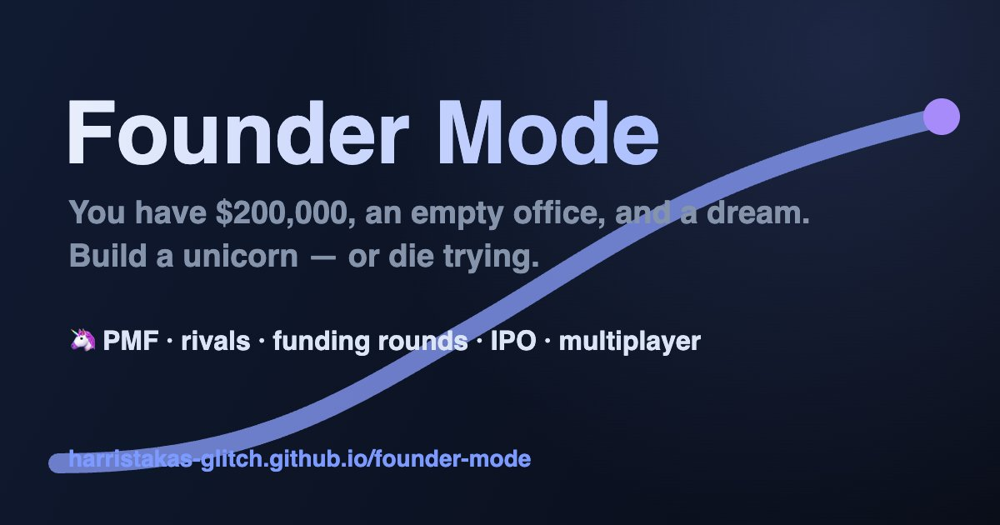

# Founder Mode 🦄

**Run a startup like a football manager.** You have $200,000, an empty office, and a dream — find
product-market fit, outgrow your rivals, survive your own board, and build a unicorn. Or die trying.

**Play now:** https://harristakas-glitch.github.io/founder-mode/



## The game

Founder Mode is a turn-based management sim. Each turn is one week: set your team's focus, hire and
fire, spend on marketing, answer the events in your inbox, then hit **Advance Week** and watch the
simulation respond. Runs end in bankruptcy, acquisition, getting fired by your board, an IPO — or a
$1,000,000,000 valuation.

It is a fully client-side single-page app. There is no game server, and that fact shapes most of the
honest caveats at the bottom of this file.

---

## Three modes, one simulation

```
PLAY
├── QUICK PLAY   ⚡  Standard Run · Daily Challenge · Scenarios
├── CAREER       🏛  a deeper founder simulation (Early Access)
└── ARENA        ⚔️  multiplayer PvP, 2–4 players
```

| Mode | Promise | What it is |
|---|---|---|
| **Quick Play** — 30–60 min · Solo | *Build a unicorn tonight.* | Fast startup management. Every shipped system is on. |
| **Career** — Deep Simulation · Solo | *Build the company. Become the CEO.* | Quick Play plus a real product-market-fit simulation: segments, beliefs, experiments, cohorts. |
| **Arena** — 2–4 Players · Online | *Outbuild your friends.* | Same engine, lean ruleset, five direct attacks between founders. |

Quick Play has three **formats** (`src/game/engine.ts:174` for the scenario list):

- **Standard Run** — open-ended, six sectors (B2B SaaS, Social App, Fintech, Dev Tools, E-commerce, AI/ML Infra).
- **Daily Challenge** — 104 weeks, fixed seed, global leaderboard. "One attempt" is enforced at the
  data layer — unique `(day, player_id)`, keep-the-higher-score — not in the client. Replaying today
  is still allowed, by design.
- **Scenarios** — five alternate starts: Standard, Funding Winter, Rich Kid, Second-Time Founder,
  Late Entrant. Scenarios change the **starting state**, never the ruleset (`src/game/modes.ts:365`).

### Capabilities are the single source of truth

Everything that differs between modes lives in `src/game/modes.ts` as **capabilities**, resolved once
per run: `MODE base → FORMAT overrides → SCENARIO overrides → lobby overrides`. The engine and the UI
ask `hasCapability(state, key)` — never `mode === '…'`. Three competing re-implementations of that
one predicate (in `engine.ts`, `store.ts` and `world/tick.ts`) were consolidated; the four remaining
`mode ===` checks are cross-promotion copy and the resolver itself.

Two rules hold in both directions, and `test/modes.test.ts` pins them:

- A capability is **never `true` before the code that honours it exists.** 29 of the 61 keys are pure
  roadmap surface — declared so the shape is stable, `false` everywhere, referenced by nothing.
- A capability is **never `false` while its system runs.** `narrativeDirector` and `proceduralMedia`
  used to claim absence for code that executes in every mode; they are now declared true where they
  run.

The header comment in `modes.ts` splits the keys into **ENFORCED** (flipping the flag changes
behaviour) and **DESCRIPTIVE** (a true statement about the mode that nothing branches on) and tells
you how to re-check it: `grep -rn "'<key>'" src` should find a `hasCapability` call for every
enforced key and none for a descriptive one. That block was audited key by key and had drifted in
three directions, so re-run the grep rather than trusting the list.

What is actually on, resolved from the code:

| | Quick Play | Career | Arena |
|---|---|---|---|
| AI rivals | ✅ | ✅ | — (`humanRivals`) |
| Story arcs · 1:1s · catastrophes · founder energy · board reviews | ✅ | ✅ | ❌ off by default |
| Bank debt · verticals · IPO · macro shocks | ✅ | ✅ | ✅ |
| PvP attacks · shared hiring pool · seeded shared world | — | — | ✅ |
| Detailed PMF · customer research · hypothesis board | — | ✅ | — |
| Relationships · advisor opinions · promises (living world) | — | ✅ | — |
| Customer interviews · employee conversations · board meetings | — | ✅ | — |
| Procedural narrative · media · Narrative Director · persistent characters · company memory | ✅ | ✅ | ✅ |
| Character memory | ✅ | ✅ | — |
| Leaderboard · single attempt | Daily only | — | — |

Career adds **eleven** capabilities over Quick Play. Nine are enforced — `detailedPMF`,
`customerResearch`, `hypothesisBoard`, `relationships`, `advisorOpinions`, `promises`,
`structuredInterviews`, `structuredEmployeeConversations`, `proceduralBoardMeetings`. The other two,
`customerSegments` and `decisionJournal`, are descriptive: the segment model and the journal live
inside the Career subsystem, so `game.career` existing *is* the switch, and turning either flag off
alone does nothing.

---

## Core systems

Shared by Quick Play and Career unless noted. Arena switches most of the narrative half off.

| System | What it does |
|---|---|
| **Product-market fit (Quick Play)** | Every idea has a hidden market resonance. Research reveals it; pivoting rerolls it, with accumulated research improving the odds. **Career replaces this entirely — see below, and note that in Career a pivot has nothing to reroll.** |
| **Rivals** | Three AI competitors per market, seeded, with their own funding, launches and failures. They take your users when their product is better — or you can acquire them, cash or stock, with rebuff risk. They also **fight back**: a rival who holds a real piece of the market raids a fast-growing upstart, one who out-raised you by two rounds comes for your people, one losing the comparison threads briefs against you, and a cornered one starts a price war. The posture is a reading of state they can plausibly see, it is shown on the rival table a week before their first move, and the crisis retainer and counter-punch answer it (`docs/balance-baseline.md` §5). |
| **Fundraising** | Pre-seed → Series C. Term sheets price off valuation and the funding climate; round sizes chase growth. Down rounds hurt. One emergency bridge exists for a company worth saving — it costs 15% of your remaining stake, and there is no second one. |
| **The board** | Investor money brings a growth target. First review 12 weeks after the round, then every 10. Pass on user growth, revenue growth, or (from Series B, at a >15% net margin) real profitability. A near miss is a warning; a real miss is a strike. **The ultimatum fires on the third strike** — submit to layoffs or defy the board and bet your job on the next review. |
| **Macro economy** | A market index, central-bank rate and inflation tick weekly, driving the funding climate, pricing your debt and inflating salaries. Oil shocks, rate cuts, rallies, crashes. |
| **Bank debt** | Borrow up to half your ARR, capped at $10M, at rate + spread, no dilution — against a revenue covenant stated up front. |
| **Team** | Employees have skill, morale, salary and a trait: **10x** (×1.7 output, only rolls on skill ≥ 8), **Mercenary** (×1.15, and walks at morale 55 rather than 32), **Craftsman** (×1.1 and quietly kills bugs), **Culture carrier** (lifts morale weekly), **Drama magnet** (drains it). Offers can be declined, notice periods apply, recruiters take 15% of first-year salary. |
| **Coordination overhead** | Past 8 people, every extra head costs the whole org 1.5% effectiveness, down to a 60% floor. |
| **All-hands pitch** | Three styles — Vision, Numbers, War — each with live success odds computed from the state of the business. 8-week cooldown. |
| **New verticals** | Send a tiger team into a second sector with its own PMF journey and TAM. Multi-product companies stack S-curves. |
| **IPO** | $500M valuation + $10M ARR + $2M for bankers unlocks the S-1: four weeks of scrutiny, four of roadshow, then pricing day — pop, modest debut, or a pulled offering. |
| **Story arcs** | Six multi-week narratives with memory: the MegaCorp pilot, a regulator inquiry, the influencer who turns, the acquired team that gels, the whale that wobbles, the open-source clone. |
| **Founder energy** | A 0–100 tank. Founder *actions* drain it — pivot −12, investor pitch −10, filing the S-1 −10, all-hands −8, M&A −8, board ultimatum −5, PvP attack −4 — and low energy weakens everything you touch. Dropping to 5 forces a burnout week. (See Known limitations: cash stress does **not** erode it, despite the comment above the formula.) |
| **One-on-ones** | Employees bring asks to your door — promotions, remote work, side projects, sabbaticals — with consequences targeted at that person. |
| **Catastrophes** | Late-game, sector-flavoured: the fintech breach, the social algorithm change, the e-commerce logistics meltdown, the dev-tools CVE. |
| **Secondary sales** | From Series B: 2% of the company at a 30% discount, banked into your final payout however the run ends. Once per stage. The panel states the trade in your own numbers — 2% of the company for cash worth 1.4% of it — because it is a hedge that survives bankruptcy, not a value play (−24% on final score if the run goes well). |
| **Events & achievements** | A 66-card event deck — every option shows its price — and 26 cross-run achievement badges. |
| **Verifiable runs** | Every simulation-mutating action is journalled, and `replayRun` re-executes the log through the *same registry functions* live play uses — so coverage is architectural, not a discipline someone has to remember. A 90-week run journals to ~4.3 KB. The results screen reports `verified` / `desync` / `no decision log`, and a test proves the honesty property: an unjournalled mutation makes verification go **red**, never silently green. |
| **The run biography** | A chaptered Story screen assembled from what the run already recorded — inbox, company memory, promises, the Career journal, the token ledger, the ending — in the game's own voice. A pure read: building it 100× leaves the state byte-identical and draws from no RNG stream. Shares as a 1200×630 card off the same lazy canvas the results card uses. |

---

## Career: you do not know your market yet

Career Phase 1 — **PMF Discovery 2.0** — is shipped. Quick Play asks whether your idea resonates.
Career asks *with whom*, and makes you pay to find out. Code: `src/game/career/`.

> **Read [`docs/career-guide.md`](docs/career-guide.md) before anything else.** It is the measured
> account of the model — every number in it was produced by running the code, not by reading the
> formula — and it explicitly lists where `docs/career-phase-1-pmf-discovery.md` (the original spec)
> has gone stale. Where the spec and the guide disagree, the guide is the one that was checked.

**Three customer segments per sector**, fifteen in all, with genuinely different economics:

| Sector | Cheap to reach, quick to leave | Harder to win, but they stay | Slow, demanding, pays like it |
|---|---|---|---|
| **B2B SaaS** | Freelancers | Small Teams | Enterprise |
| **Dev Tools** | Individual Developers | Startup Engineering Teams | Enterprise Engineering |
| **E-commerce** | Individual Sellers | Growing Brands | Enterprise Retailers |
| **Fintech** | Everyday Consumers | SMB Finance Teams | Regulated Institutions |
| **Social** | Casual Users | Creators | Brand Advertisers |

Each segment holds nine hidden numbers — problem intensity, willingness to pay, retention potential,
reachability, product bar, market size, competitive intensity, sales cycle, expansion potential.
They are generated once from `(seed, sector, scenario, segmentId)` and **never rerolled**: not by
research, not by a pivot, not by reloading. Variance around each archetype is wide (`need ±24`,
`willingnessToPay ±18`, `productRequirement ±14`) — wide enough that the archetype ranking is often
wrong for your seed. Which segment is best is a fact about your seed, and you have to go and find it.

**You never see those numbers.** You see beliefs: an estimate, a band that narrows as confidence
rises, and a confidence label. Every segment starts with one metric given a *confident and badly
wrong* prior. Confidence saturates — you cannot become certain from a chair.

**Five experiments, on a reliability hierarchy.** Stated intent is cheap and weak; behaviour is slow
and strong. Three can run at once (`src/game/career/pmf.ts:233`).

| Experiment | Time | Cash | Also costs | Base reliability | Measures |
|---|---|---|---|---|---|
| Customer interviews | 2 wks | $4,000 | — | 0.34 | problem intensity, product bar, willingness to pay |
| Landing page test | 2 wks | $6,000 | $3k/wk marketing | 0.44 | reachability, problem intensity, market size |
| Prototype test | 3 wks | $12,000 | 35% of engineering | 0.62 | product bar, problem intensity, retention potential |
| Pricing test | 3 wks | $9,000 | 10% eng, $2k/wk marketing | 0.70 | willingness to pay, reachability |
| Paid pilot | 7 wks | $28,000 | 45% of engineering | 0.88 | retention potential, willingness to pay, product bar, expansion |

The capacity costs are real and they compound: measured product velocity is ×0.55 with a pilot
running, ×0.30 with a pilot and a prototype together — the floor. Marketing drain is subtracted from
your ad budget *before* acquisition sees it, so a landing-page test on a $3k/wk budget buys zero
customers. A **standing study** renews itself, but retires automatically once the belief it exists to
move passes its confidence bar, so it can no longer bill forever for information that stopped
arriving.

**Cheap evidence lies in a predictable direction.** Effective reliability falls further with a small
sample, a weak team, and a hard-to-reach segment. Interviews and landing pages systematically
*overstate* willingness to pay. The test suite measures it: interviews overstate WTP by **21.1
points** on average, a pricing test by **2.9** — the nine-said-they'd-pay-and-two-actually-did lesson,
encoded. The reverse trap exists too: a prototype test run with a weak product returns a false
negative on a market that was fine.

**Customers arrive in cohorts.** Each week's intake keeps its own acquisition price and product
quality, and retention is resolved per cohort, per week. Four-week retention is frozen once per
cohort, off the unrounded survivor count. Aggregate growth can hide a rotting base, which is the
entire reason cohorts exist.

**PMF is an output, never an input.** Company PMF is the single best-scoring segment (not an average,
not the target). Above the customer floor the 100 points are: retention 46, price fit 20, product fit
14, scale 12, market headroom 8 — and retention is close to all of the variance in practice.
Below 15 retained customers the score is capped at 40 and comes *entirely* from belief confidence;
above the floor, confidence contributes *exactly zero*. High acquisition with low retention scores as
*Showing value*, not fit. Both are asserted in `test/career-pmf.test.ts`.

Two properties worth knowing before you play:

- **Features do not drive Career PMF. Quality does.** Features generate bugs, bugs cut retention, and
  retention is 46 of the 100 points. Measured at 40 weeks: 70% features → PMF 47; 70% quality → PMF
  60. Pointing 100% of engineering at *research* beats pointing 70% at features.
- **Research and the demand gauge move belief, not PMF.** The `pmfGain` line still executes and is
  then overwritten by `tickCareerPMF` in the same tick. The Product screen's STRONG/WEAK demand
  readout is `s.resonance`, which in Career influences nothing. See Known limitations.

**Changing your mind costs something.** A segment reposition triggers 2–6 weeks at ×0.7 product
output and ×0.55 acquisition, sized by how far apart the two segments' bars and price tolerances are.
Existing customers are not deleted. Everything goes in the decision journal.

Each week also produces causal explanations, the biggest open uncertainty, and a suggested next
experiment with its reasoning. The Career-only **Discovery** screen holds the Hypothesis Board, the
experiment catalogue, your bet and the journal; it is gated on `hypothesisBoard`, so it never appears
in Quick Play or Arena.

**Quick Play, Daily Challenge and Arena carry no Career state at all** — `career` is absent from those
saves, and the test suite asserts it for all three.

---

## Living World

`src/game/world/` — persistent people who are generated once, remembered, and narrated.
The design brief is [`docs/procedural-living-world-system.md`](docs/procedural-living-world-system.md),
which lays out **sixteen phases**.

**Built — the brief's phases 1–8**, plus the persistence and regression work that goes with them
(phases 14–16):

- **1–5, every mode.** Shared foundation (persistent characters, company memory), character memory,
  relationships, the procedural composer, the Career dynamic inbox, and the Narrative Director —
  which scores every candidate story each week and decides what deserves to be told, with a wider
  budget in Career than in Quick Play. Media-voiced coverage of company-level facts runs alongside
  it. Quick Play and Arena get the narrative layer (phases 10–11) but not the relationship
  simulation.
- **6–8, Career only.** `advisorOpinions` — named people reading the same week through different
  weights and disagreeing about it on the Dashboard. `promises` — the choices that ARE commitments
  (defying the board, answering the raise demand, signing a term sheet) tracked against their own
  deadlines and settled from the simulation's own verdicts. `structuredInterviews`,
  `structuredEmployeeConversations` and `proceduralBoardMeetings` — the three rooms where the
  founder answers back: §41's eight questions put to three procedurally generated customers with
  hidden biases, an employee conversation opened by a genuinely strained relationship, and a board
  meeting composed from the same week the advisors read. A commitment made in a room joins the
  promise ledger and is judged later against a simulation fact.

**Not built**, with every corresponding capability `false` in every mode — this is the honest list,
by system rather than by phase number:

`longTermCallbacks` · `rivalArchetypes` · `rivalNarrative` · `proceduralPostmortem` · `livingWorld`
(the umbrella flag). Story arcs are still the hand-written six, not state machines.

One thing to know before you work in here — from `docs/architecture-review.md`:

- **There are two memory-selection engines and only one is live.** `memory.ts` has a scored recall
  system (`resolveCue`, `scoreMemoryRelevance`, `recallMemories`, ~200 lines) that nothing calls;
  `composer.ts`'s simpler `selectMemoryCallback` is the one on the live path. When you next tune
  memory recall you will find the wrong one first, because it is the bigger of the two.

And one rule the subsystem is built around, which phases 7 and 8 both had to learn: **nothing in
`world/**` may write to `s.inbox`.** The simulation READS inbox windows upstream of seeded draws —
the 1:1 dedupe scans the first 12 messages, the weekly event picker the first 8 titles — so one
extra message shifts an RNG draw count and `npm run bots` stops being byte-identical. The living
world reaches the player through panels, never through mail.

---

## Tokenisation: the other capital path

`src/game/token/` — Career only, behind seven capabilities. The design brief is
[`docs/tokenisation-ico.md`](docs/tokenisation-ico.md); the contract every slice was built against
is [`docs/ico-architecture.md`](docs/ico-architecture.md). **All seven slices are shipped.**

Once a company has a real community it can stop raising equity and launch a token instead. The fork
is **irreversible** and it closes the institutional path permanently — no more rounds, no IPO. What
opens in return is a second economy with its own capital, its own counterparty and its own endings.

| Slice | What it added |
|---|---|
| **1 · The fork** | Eligibility read off the run's own numbers, sector suitability, the launch terms preview, and the one rule the whole feature hangs on: `valuation()` never absorbs token market cap. `founderStanding` meets it in two **disjoint legs** — equity × enterprise value, plus the realisable token position — so no dollar is ever counted twice. |
| **2 · The economy** | Price, supply, treasury, utility, speculation, depth — every reflexive loop shipped with an explicit restoring force, bot-proven against runaway and absorbing states. |
| **3 · Organic vs incentivised** | Bought users are real users and are **not evidence**. `derivePmfForSegment` sees organic cohorts only — exclusion, not weighting, because any weighting means enough spend still buys Strong PMF. |
| **4 · Tokenomics & incentives** | The allocation you negotiate inside a band the community sets, and six incentive categories run as standing shares of a weekly token budget. |
| **5 · The community** | The counterparty. A conduct ledger drags trust for treasury sales, rented growth and the founder's unsold overhang; `founderInfluence` prices how a sale reads; below trust 30 holders leave **and sell on the way out**. |
| **6 · Governance** | Proposals emerge from that state and **votes resolve from state, never from a roll** — two seeds give different prices and the identical vote. Passed votes bind: budget floors, sale freezes, and a telegraphed community ouster that routes to the existing `fired` ending. |
| **7 · Endings & founder sales** | The `network` ending, and §42 founder secondaries that finally make `bankedPayout` reachable on this path. |

**Two things measurement changed, and they are worth reading before you touch any of it.**

The token path once beat the traditional one by **1.83×–25.10×** — and won *strictly*: higher floors,
fewer failures, unicorns where equity runs had none. Three structural fixes closed it, none of them a
retune: the initial sale now **dilutes** like the round it replaces, incentive intensity is
denominated in float share rather than dollars (the price re-rated 9.9–90× per run, so a fixed 0.8%
of float silently bought ninety times more customers late than early), and an early community funds a
seed rather than the whole book. The band is now **1.07×–2.07×**, and Late Token is the best arm in
several sectors, so *when* to launch is a real decision.

The `network` ending as originally specified **fired zero times and was worth $0.00** — the $1B gate
sat above the p99 of ~450 measured runs, and its payout was exactly what a still-trading token run
already scored. It now gates at $100M with §1.4's anti-bubble clauses kept verbatim and three added
(six consecutive weeks, network ≥ company, trust ≥ 42), and it is an **offer, not a terminus**: as an
automatic ending it was a *trap* in 17 of 25 runs it fired in, because the gate closes around week 65
while the network is usually still compounding.

---

## Arena: lean, fast, mean

2–4 founders on different devices share one seeded market. Rooms have 5-letter codes; rounds advance
when everyone is ready or the 150-second clock expires, at which point pending choices resolve
conservatively and the week is forced. Live standings, chat, emotes.

The host picks the sector, the match length (⚡ Sprint 52 weeks / 🏁 Classic 104) and can toggle any of
the **ten** rule systems in the lobby (`src/screens/Lobby.tsx:10`) — from a pure-PvP knife fight to a
full-depth marathon. By default the slow narrative systems (arcs, 1:1s, catastrophes, founder energy,
board reviews) are off so turns stay fast, and the economic weapons (debt, verticals, IPO, macro)
stay on.

### Five attacks

Base costs, before stage scaling. Every attack costs `base × (1 + stageIndex × 0.5)`, puts your ops
team on a 5-week cooldown, and tells the victim exactly who did it. Each also calls `drainEnergy(s, 4)`
— which is a **no-op in a default Arena match**, because `founderEnergy` is off unless the host turns
it on in the lobby.

| Attack | Base cost | Effect |
|---|---|---|
| 🎣 **Poach talent** | $50k | They lose their best person and 6 morale; two above-average candidates land in your hiring pool |
| 🗞 **Smear campaign** | $40k | Their hype −10 and reputation −3 — and 2 points of mud sticks to you |
| ⚔️ **User raid** | $80k | They lose `max(4% of users, min(15%, 18 users))`; you gain 0.8× that, scaled 0.5×–3× by how much bigger they are than you |
| 📰 **Hit piece** | $55k | A three-week campaign, front-loaded (−9/−6/−4 hype). Escalating chance it is traced back to you: 18%, 37%, 56%, capped at 75% |
| 📉 **Price war** | $30k | Six weeks of undercutting that cuts **both** sides' revenue. 8-week cooldown after it ends |

The last two are the ones that cost the attacker.

- The **raid floor** exists because damage used to be purely proportional: measured on a real match,
  a $120k raid against a 120-user rival moved *five users*. The floor makes an attack worth its price;
  the 15% cap stops it flattening a small company.
- **Hit-piece backfire is derived, not rolled** — a pure function of `(seed, week, attackerId,
  timesUsed)`. Arena has no referee, so an attacker rolling locally could simply retry until the dice
  came up clean.
- A **price war** is the only attack that bills you too. The initiator takes the smaller cut (×0.88
  vs ×0.74 at the extremes), and the gap closes as their own margin worsens. The defender can
  **concede**: prices go back up, and 6% of their customers transfer to whoever started it. The
  8-week post-war cooldown exists because the generic 5-week attack cooldown was shorter than the
  6-week war, so bots re-declared the instant it lapsed and spent 86% of all weeks at war.

The counterplay is the **Crisis Retainer**: `$120k × stageIndex+1`, buying 8 weeks in which *every*
incoming attack fizzles before it touches morale, press or users. The attacker still pays and still
burns their cooldown. Your rivals don't know you have it.

### Match rules

- **One hiring market for the room**, settled by **sealed bid with commit-reveal** rather than
  first-click. You commit a hash of `(candidate, premium%, nonce, playerId)`, then reveal. The
  candidate weighs money against reputation and runway, weighted so that money matters *less* the
  better the candidate is. A maxed bid beats an indifferent rival every time and loses 100% of the
  time to a strong rival on high-skill candidates. There is no free hire: the winning premium binds
  into the salary and the 15% recruiter fee.
- **Sticky roster.** Presence is ephemeral, so once the match is under way a peer who blips off the
  socket is flagged absent rather than deleted. Deleting them erased a rival from the standings *and*
  from the market-share denominator, which then read as 100%.
- **Forfeit at 75 seconds absent** (`FORFEIT_MS`). Someone who closed the tab leaves nothing to play
  against.
- **Ranking is on money, not on breathing.** A founder still trading is valued at their valuation, a
  founder who exited at their payout, and they are sorted together. There used to be an alive-first
  tier, which told a player acquired for $13.2M that they came second to a rival trading at $2.12M.
- **A rival's exit is a number to beat, not the end of your game.** If rivals finish and you are still
  going, the match continues and their best banked figure becomes your target. It ends only when
  nobody is contesting, or when one founder is left and everyone else *walked away* rather than
  finished.
- **Automatic reconnect.** A supervisor rejoins with backoff instead of making you refresh; it holds a
  `rejoinInFlight` flag and a shared teardown so a flapping network cannot leak channels or spawn a
  ghost copy of you in the room.

---

## Tech

- **Vite 7 + React 19 + TypeScript (strict) + Tailwind CSS v4 + Zustand** (persisted to
  localStorage) + lucide-react
- **Simulation**: pure functions in `src/game/engine.ts`, bot-testable headlessly
- **Multiplayer**: Supabase Realtime channels only — presence + broadcast, no tables, no SQL. Each
  client simulates its own company.
- **Leaderboard**: one Supabase table. Run **`supabase/leaderboard-v6.sql`** — it is the only SQL
  file in the repo, it creates the table as well as securing it, and it is idempotent.
- **Auth (optional)**: Supabase Auth with Google / X OAuth. Anonymous play is always available.
  The providers are written but **not enabled** on the live project — the buttons error if pressed.
- **PWA**: installable, offline-capable (service worker, production build only), with an
  update banner when a new build is available.

### Determinism

The contract: same seed + mode + format + scenario + decisions reproduce the same **numbers**.

Every simulation draw goes through `RNG.next()` inside a `withSeed`/`mixSeed` (mulberry32) scope;
`advanceWeek` reseeds from `(seed, week, 0)`, and eight other mutating entry points (pivot, pitch,
attack, acquire, venture, all-hands, inbox choice, living-world tick) are wrapped in `seeded()`.
`career/**` takes its RNG by injection; `world/**` derives every stream from `(seed, id)`. Investor
selection is a real seeded shuffle — splice-based selection, the same pattern as `makeRivals`. It
used to be `sort(() => RNG.next() - 0.5)`, which is not a shuffle and whose output depends on V8's
sort implementation.

`test/modes.test.ts` guards the draw order with **golden traces on three seeds** — recorded FNV-1a
hashes of twelve weeks of state, not a self-comparison. Reorder or insert a single draw and they go
red. Changing them is allowed; re-record in the same commit as the change.

Two holes, both real and both documented in the code:

- `uid()` uses `Date.now()` and `Math.random()`. It does not perturb the seeded stream (`withSeed`
  swaps `RNG.next`, not `Math.random`), so the numbers replay — but **ids do not**, which is why
  `world/tick.ts` needed `stableCastId()` and the shared hiring pool uses `mk-{week}-{i}`. Replay-based
  score verification is impossible until this changes.
- `RNG` is a mutable global whose unseeded default *is* `Math.random()`. Any future entry point that
  forgets `seeded()` silently gets true randomness and nothing complains.

### Layout

```
src/
  game/            # the simulation
    modes.ts       #   the capability model — read the header comment first
    engine.ts      #   2,670 lines; advanceWeekInner is the RNG-order-critical core
    data.ts        #   sectors, investors, the 66-card event deck, the RNG global
    arcs.ts        #   six story arcs
    achievements.ts
    pvp.ts         #   hit piece + price war (the two attacks that cost the attacker)
    career/        #   Career-only PMF discovery: types, segments, pmf, tick
    world/         #   Living World phases 1–8: characters, memory, relationships,
                   #   composer, director, advisors, promises, interactions,
                   #   persistence, content/
  screens/         # one file per screen (Dashboard, Product, Market, Discovery,
                   # Finance, Hiring, Team, Growth, Inbox, Fundraising, Lobby,
                   # NewGame, Career, DailyLeaderboard)
  net/             # Supabase: config, realtime rooms, leaderboard, auth
  components.tsx   # shared UI primitives (charts, cards, avatars)
  theme.ts         # sector accents, ending emoji/labels, GAME_URL — React-free on purpose
  store.ts         # Zustand store: game actions + online match protocol
  App.tsx          # shell: nav, topbar, overlays, result screens
test/              # the suites in `npm test` + the probe harnesses (plain tsx scripts)
docs/              # design specs and the three review documents
supabase/          # SQL to run in the Supabase SQL editor
scripts/           # singlefile.mjs — bundles the game into one HTML file
```

---

## Develop

```bash
npm install
npm run dev        # dev server on :5173
npm test           # seven suites, headless, against the real engine
npm run build      # tsc -b + production build to dist/
npm run bots       # Career bot sweep: 24 seeds × 90 weeks × SaaS and Fintech

npm run build && node scripts/singlefile.mjs   # optional: self-contained "Founder Mode.html"
```

`npm test`, `npm run build`, `npm run bots` and `scripts/singlefile.mjs` were each run against this
tree while writing this file, and all pass. (`Founder Mode.html` and `dist/` are gitignored build
artifacts.)

`npm test` runs, in order:

| Suite | What it pins |
|---|---|
| `modes.test.ts` | capability resolution order, sanitisation, legacy-save migration, and the **golden traces** |
| `career-pmf.test.ts` | truth never rerolls, instrument bias measured in points, PMF cannot be researched into existence, Quick/Daily/Arena carry no Career state |
| `rules.test.ts` | Arena's ruleset really does suppress what it claims, and attacks/costs/cooldowns/shield behave — with a Quick Play positive control proving arcs and 1:1s actually fire |
| `regressions.test.ts` | determinism and past bug fixes |
| `hiring-market.test.ts` | the shared auction and offer acceptance, driving the real engine functions |
| `world-foundation.test.ts` | living-world persistence and migration |
| `world-director.test.ts` | story scoring, novelty decay, per-week budget |

Not in `npm test`, run by hand:

```bash
npx tsx test/exploit-probe.ts all       # 12 degenerate policies × 5 sectors (~10 min)
npx tsx test/arena-auction-probe.ts     # 1,000 head-to-head auction contests
npx tsx test/pricewar-probe.ts
npx tsx docs/security-tests/net-security.test.mts       # 34 assertions, offline
npx tsx docs/security-tests/leaderboard-live.test.mts   # 16 assertions — WRITES TO PRODUCTION
```

**Several suites were rewritten because they passed while the game was visibly broken.** The worst
case was a test file that had transcribed `acceptChance` out of `engine.ts` into itself and asserted
against its own copy: five green ✓ lines, zero engine code executed. Another asserted
`victim.users < 50_000` — a raid that moved five users satisfied it for the entire life of the defect
players reported. The habit that prevents this: **when a test needs a number from the source, import
the number.** If it cannot be imported, that is the finding.

Deploys to GitHub Pages on every push to `main` (`.github/workflows/deploy.yml`). The workflow runs
`npm test` before `npm run build`, so a red suite blocks the deploy rather than shipping.

### Versions and rolling back

Tagged versions live under
[Releases](https://github.com/harristakas-glitch/founder-mode/releases). Each marks a state where the
tests, the type-check and the build all passed, with a self-contained `.html` build attached —
double-click it to play that exact version offline, which is the fastest way to check whether a bug
is new.

```bash
# put the site back on a previous version (nothing is erased; you can roll forward again)
git revert --no-commit v1.0.0..HEAD && git commit -m "Roll back to v1.0.0" && git push

# cut a new version once npm test and npm run build pass
git tag -a v1.1.0 -m "what changed" && git push origin v1.1.0
```

### Online setup on a fork

The game runs fully offline and anonymous without any of this.

1. Create a free [Supabase](https://supabase.com) project; paste its URL and publishable key into
   `src/net/config.ts`. **Arena works immediately** — realtime channels need no schema.
2. Run `supabase/leaderboard-v6.sql` in the SQL Editor. It is the only SQL file in the repo, it
   creates the table as well as securing it, and it is idempotent and self-testing: its last
   section runs the whole attack matrix against the policies it just created — as both database
   roles — and raises with a list of failures if any case comes out wrong. A successful run prints
   `leaderboard v6 self-test passed`. Ownership of a row is proved by a per-device secret the
   database stores only as a **bcrypt hash**; each `player_id` is bound to the first device that used
   it; and a trigger makes `player_id`, `day` and the secret immutable and scores monotonic, so even
   a leaked secret can only ever raise that one row's score.
   **`§1` of that file carries a KEEP IN SYNC warning:** the day-window constant mirrors
   `DAILY_EPOCH` in `src/store.ts`. Changing one without the other is exactly how the leaderboard
   silently rejected every real submission for two versions running.
3. Optional social login: set Site URL and the redirect allowlist under Authentication → URL
   Configuration, then enable the Google and/or X provider with OAuth credentials from their
   consoles.
4. Set a spending cap and usage alerts. The publishable key is public by design and nothing else
   rate-limits it. (On the Supabase **free** plan this setting does not exist — free projects
   hard-stop at quota. It becomes real the moment you upgrade.)

---

## Balance

Every mechanic ships with headless bot validation. `npm run bots -- all` runs three Career
strategies over 24 seeds × 90 weeks in all six sectors. Measured on this tree, B2B SaaS:

| Strategy | Failed | Exits | Customers (median) | 4wk retention | Revenue/wk | Founder net |
|---|---|---|---|---|---|---|
| **Careless Growth** — spend, never research | 0 / 24 | 7 | 509 | 66% | $3,955 | $4.0M |
| **Disciplined Discovery** — experiment first, scale late | 3 / 24 | 6 | 256 | 76% | $8,182 | **$6.2M** |
| **Enterprise Bet** — pivot high, price premium, build to the bar | 2 / 24 | 2 | 177 | 72% | $5,414 | $4.3M |

Disciplined Discovery is strongest in **all six sectors** — that ordering is the property the harness
exists to protect, and every balance change since has been checked against it.

Two things this table is not. **`failed` is bankruptcy and firing only** — an acquisition is an
*outcome*, not a death, and reporting `alive = !gameOver` is what once made coasting look like the
best strategy in the game (it scored 24/24 by never being worth buying). And the milestone column is
**weeks-to-profitability**, not the old `$2k/wk` bar, which every strategy cleared by week 10 once
Career's revenue was calibrated and so discriminated nothing.

The harnesses, all of them measure-first:

| Harness | What it answers |
|---|---|
| `npm run bots -- all` | the three Career strategies, per sector |
| `npm run balance -- <mode>` | ladder / unit economics / headcount / pricing / land-grab / margin |
| `test/deep-balance-probe.ts` | Quick Play: the allocation simplex, founder kinds, inbox choices, the covenant |
| `test/token-balance-probe.ts` | the capital fork: 18 arms including exploit and counterfactual arms |
| `test/arena-duel-probe.ts` · `arena-ffa-probe.ts` | 1v1 and 4-player attack balance |
| `test/exploit-probe.ts` | deliberately degenerate policies, looking for lines that beat real play |

Re-run the numbers rather than trusting any table here if the economy has been touched. An earlier
version of this one was inflated by a rounding bug that made small cohorts report 100% retention
forever; a later one was measured before Quick Play's revenue rate was fixed. **Both read as fact at
the time.**

---

## Known limitations

All of these are verified. None is a plan; they are the state of the thing.

**Arena and multiplayer**

1. **There is no server referee, and no peer authentication.** Supabase Realtime broadcast carries no
   sender identity and presence keys are self-chosen. The rules that exist — *nobody may speak as me*
   (broadcast is `self: false`), *a claimed id must be in the presence roster*, inbound token buckets
   per sender and globally — are **self-defence, not mutual auth**. A hostile client can still take a
   seat under another id and cause the room's clients to disagree. Closing it needs self-certifying
   (signed) player ids, mandatory login with Realtime Authorization, or an authoritative server.
2. **Peers are trusted for their own numbers.** `users`, `val`, `payout` and the open-book intel
   columns are self-reported. The receive path is hardened against crashes, NaN and hangs — not
   against a peer lying about how well it is doing.
3. **Two security patches from `docs/security-review.md` are still unapplied.** Both are one-liners in
   `src/store.ts` and both are live today:
   - `src/store.ts:594` — the incoming-attack rate limit keys on `` `${p.fromId ?? p.fromCompany}` ``.
     Company names are attacker-chosen, so the fallback is an unlimited-free-hits path.
   - `src/store.ts:399` — `if (host && p.hostId && p.hostId !== host.id) return null` fails **open**:
     omit `hostId` and the check is skipped entirely, so any peer in a lobby can start the match with
     settings of their choosing. (The transport rate-limits `start`, so this is griefing, not
     mid-match hijacking.)
4. **There is no two-client Arena test harness.** Everything realtime — presence merge, commit/reveal
   across clients, attack delivery, catch-up, reconnect, forfeit — is verified only by unit tests over
   the validators and by playing. The realtime paths are **not** verified end to end.
5. **Room codes are enumerable.** 5 characters from a 32-symbol alphabet ≈ 33.5M codes. Prediction is
   closed (CSPRNG), scanning is not.
6. **The hit piece's designed anonymity does not exist.** `PR_DECOY_WEEKS` and `prSourceHidden()` are
   written in `src/game/pvp.ts` and referenced by nothing; `applyAttackIncoming` names the attacker
   immediately, like every other attack.

**Leaderboard**

7. **Scores are verifiable locally, and not yet to anyone else.** This entry used to read "scores
   cannot be verified… replay validation is blocked by the non-deterministic `uid()`". That is no
   longer true: the journal keys entities by **index at action time** rather than by id, which
   sidesteps `uid()` entirely, and `verifyRun` replays a submission and compares an end-state
   fingerprint. A fabricated score cannot produce a log that replays to it. What is still missing is
   the schema column to carry the proof to *other* players — an additive change nobody has made, so
   the leaderboard still displays unverified numbers.
8. **`display_name` is self-asserted** for signed-out players — on their own row only.
9. **There is no rate limiting.** The client's inbound token buckets protect the honest player being
   flooded; they do nothing about anyone hitting PostgREST directly with the public key. That needs
   the edge.
10. **The production table holds ~14 synthetic rows** written during the security review
    (`SECTEST-*`, "Honest Inc" / "Victim Inc", at days 10000/10001/39901/39902). Removal is a manual
    dashboard action — see `BACKLOG.md` 1.4.

**Balance — measured, and deliberately left alone**

11. **~~`low` pricing is dominated~~ — FIXED, and the diagnosis was the interesting part.** The
    original measurement compared `low` *while targeting the richest segment* — the lever against the
    wrong market. Pointed at the price-sensitive archetype every sector has, `low` was already ahead,
    but that market was itself dominated because its one compensating advantage (headroom) was never
    collected: `room` sits at 0.97–0.99 all game at both ends. A referral term that pays weekly rather
    than at a ceiling nobody reaches fixed it. `low` is now first on the price-sensitive tier in 6/6
    sectors, `market` on the middle tier, `premium` on the high-WTP tier — see
    `docs/balance-baseline.md` §2.
12. **Coasting survives more often than playing.** A bot that sets marketing to $0, hires nobody, runs
    no experiments and never raises survived **24/24 seeds in every sector**. Activity carries 4–12×
    the expected founder net, so the risk is paid for — but "the safest line is not to play" is a
    design call that has not been made.
13. **~~The Social / E-commerce gap~~ — RESOLVED, in two parts.** Social was a harness artifact:
    zero bankruptcies in 24 seeds under every hiring rule tested, so the "survival gap" was 14
    acquisitions being counted as deaths. Separately, Social's *acquisition* coefficient was the real
    outlier — `acqBase/5` reused a Quick Play constant on Career's hundreds-scale cohorts, making a
    Social dollar buy 24× the customers a SaaS dollar does, which made Social the always-right sector
    pick AND drove the token gap. `careerAcqScale` now applies a knee above human scale: four sectors
    return the old value to the bit, Social compresses. E-commerce remains the hardest sector and is
    left that way deliberately.
14. **The marketing slider's maximum is fatal in one drag** — $30k/wk at pre-seed against $200k is 6.7
    weeks of runway. 0–1 of 24 seeds survive. The burn is displayed and the player is choosing it, so
    the cap is a stage gate rather than an affordability gate.

**Career model**

15. **`expansionPotential` and `salesCycleWeeks` are inert.** Both are generated with per-sector
    variance, both have beliefs, and `expansionPotential` is one of four metrics a $28k / 7-week paid
    pilot measures — but **no formula reads either**. Players pay real money to learn numbers that do
    nothing.
16. **A pivot in Career is pure loss.** It rerolls `s.resonance` (which Career never reads), zeroes
    `researchSignal`, and destroys quality, features, users, hype, morale and $15k — while never
    touching `segmentTruth`, the sector or the target segment. There is nothing to reroll. Use
    *reposition* instead. The Product screen still teaches Quick Play's model here.
17. **`repositionTo` does not change `career.focus`.** Switch target segment and you keep optimising
    for the old segment's first value: a silent swing from +18 to −8 product fit, permanently.
18. **PMF is flat for the first five weeks by construction** — the first four-week cohort snapshot
    lands in week 6, in 10 of 10 measured runs across all five sectors. Everything you do in weeks 1–5
    appears at once in week 6.
19. **The 15-customer floor is a cliff, not a ramp** — 14 retained customers scored 40, 15 scored 82.
20. **The scale term is effectively unreachable** (7,091 retained customers for full marks in SaaS
    Small Teams; 1.3M in Social Creators), so the practical PMF ceiling is ~88, not 100.
21. **The shipped default allocation is `research: 20`**, which in Career points a fifth of
    engineering at a stat that cannot move PMF.

**Engine and codebase**

22. **`advanceWeekInner` is 456 lines and its correctness *is* the statement order.** The golden traces
    are the guard; there is nothing else. Do not extract `tickHype`/`tickMorale` into another file for
    tidiness — the failure mode is silent.
23. **Founder energy cannot be eroded by cash stress**, despite the comment above the formula saying
    "faster erosion under stress". `+3 - (stressed ? 3 : 0)` exactly cancels the weekly recharge;
    measured flat at 80.00 over 12 weeks with runway pinned under 8. Only founder *actions* reduce it.
24. **The board's ultimatum fires on the second strike, while the in-game copy says three.**
    `engine.ts:2446` is `strikes >= 2`; `engine.ts:2476` renders "strike N of 3". One of them is wrong.
25. **Five copies of mulberry32, three of FNV-1a, ten of `clamp` in two incompatible signatures**
    (`clamp(v, lo, hi)` vs `clamp(v, lo = 0, hi = 100)`). The PRNG copies are bit-identical today by
    luck, not by test.
26. **UI screens re-derive simulation numbers and have drifted.** Six different runway-danger
    thresholds, three answers to "is the cash position dangerous?", two growth rates that disagree in
    weeks 1–4, and a market-share figure that excludes a second product line's users. Catalogued in
    `docs/architecture-review.md` §N; none reaches a test, because nothing covers presentation.
27. **The `e.modes` / `e.formats` fields on event cards and achievements are a second gating axis
    alongside capabilities, and zero cards use them.** Prefer a capability.

Full detail: [`docs/architecture-review.md`](docs/architecture-review.md),
[`docs/security-review.md`](docs/security-review.md),
[`docs/gameplay-review.md`](docs/gameplay-review.md), and
[`BACKLOG.md`](BACKLOG.md) for everything known-but-unfixed with what "done" looks like.

---

Built with [Claude Code](https://claude.com/claude-code).
